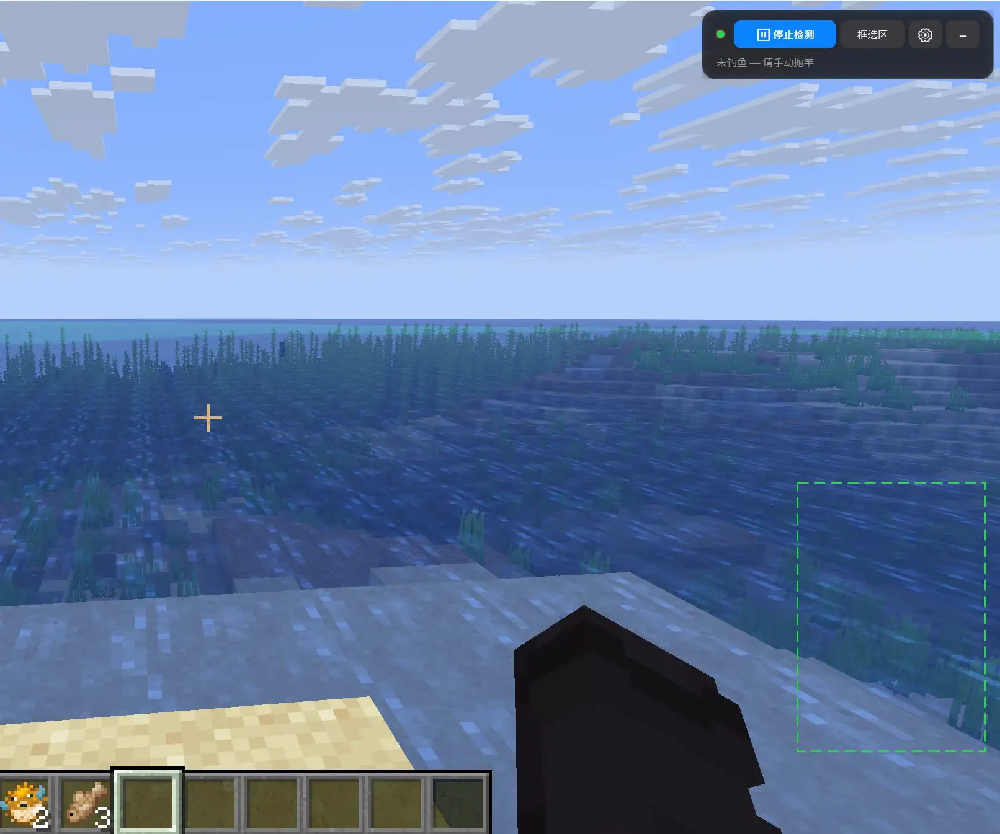

# Minecraft AutoFish

基于 WPF + OCR 的游戏自动钓鱼工具，通过屏幕截图 + Windows 内置 OCR 引擎识别游戏内钓鱼提示文字，模拟右键实现自动提竿和重抛。

## ui展示



## 想直接用？在此下载

- [ -> v1.1.0](https://github.com/aihaoDIYlove/AutoFish/releases/tag/v1.1.0) 点此跳转

## 使用说明

1. 启动 `AutoFish.exe`
2. 将游戏窗口置于前台
3. 确保游戏内 选项 -> 辅助功能设置 -> 隐藏式字幕 选项为 "开"
4. `Ctrl+Shift+S` 进入框选模式，拖拽选中游戏内显示钓鱼提示的区域（如"溅起水花""甩出"等文字）
5. 按 `Enter` 确认选区
6. `Ctrl+Shift+F` 开始检测
7. 在游戏中手动抛竿，AutoFish 会自动识别咬钩并右键提竿，收回后自动重抛

## 功能

- **屏幕区域框选** — 可视化拖拽选区，支持四角微调，适配不同分辨率和显示器
- **实时 OCR 识别** — 使用 `Windows.Media.Ocr` 引擎，支持中文/英文
- **钓鱼状态机** — Idle → Fishing → ReelingIn → ReeledIn 全自动循环
- **全局热键** — `Ctrl+Shift+F` 开始/停止，`Ctrl+Shift+S` 框选区域，`Ctrl+Shift+D` 调试面板
- **系统托盘** — 最小化到托盘，右键菜单打开/退出
- **可配置参数** — 识别短语、冷却时间、轮询间隔均可调

### 热键

| 快捷键 | 功能 |
|--------|------|
| `Ctrl+Shift+F` | 开始 / 停止检测 |
| `Ctrl+Shift+S` | 框选 OCR 区域 |
| `Ctrl+Shift+D` | 切换调试面板 |
| `Ctrl+Shift+Q` | 隐藏窗口 |
| `Ctrl+Shift+O` | 打开设置 |

### 设置参数

| 参数 | 默认值 | 说明 |
|------|--------|------|
| 抛竿短语 | `甩出` | 检测到这些文字表示已抛竿 |
| 咬钩短语 | `漂溅起水花` | 检测到这些文字触发右键提竿 |
| 收回短语 | `收回` | 检测到这些文字表示鱼竿已收回 |
| 抛竿后冷却 | 1200 ms | 抛竿后忽略咬钩检测的时间，避免水花误判 |
| 收回后重抛 | 1200 ms | 收回后自动重抛的延迟 |
| 咬钩防连点 | 2000 ms | 两次右键提竿的最短间隔 |

### 配置存储

- 配置文件位于 `%AppData%/AutoFish/settings.json`，日志位于 `%AppData%/AutoFish/log.txt`。

## 系统要求

- Windows 10 19041+ (Windows 10 2004) 或 Windows 11
- .NET 8 Desktop Runtime
- 系统需安装中文 OCR 语言包（中文用户一般默认有安装）

### 环境验证

1. 右键左下角的Windows徽标，选择 Windews Powershell(管理员) 打开命令行工具
2. 复制以下内容，回车。
```powershell
Get-WindowsCapability -Online | Where-Object { $_.Name -Like 'Language.OCR*zh*' }
```
3. 如果 "Name  : Language.OCR~~~zh-CN~0.0.1.0"
显示为 "State : Installed"
说明已安装OCR包

## 项目结构

```
AutoFish/
├── App.xaml.cs              # 应用入口、热键注册、托盘
├── OverlayWindow.xaml.cs    # 全屏悬浮窗：选区绘制、调试面板
├── ToolbarWindow.xaml.cs    # 浮动工具栏：开始/停止/框选/设置
├── SettingsWindow.xaml.cs   # 设置窗口
├── Models/
│   └── AppSettings.cs       # 配置模型（JSON 序列化）
├── Services/
│   ├── DetectionLoop.cs     # 检测主循环（DispatcherTimer）
│   ├── FishingStateMachine.cs # 钓鱼状态机
│   ├── OcrService.cs        # Windows.Media.Ocr 封装
│   ├── ScreenCapture.cs     # 屏幕区域截图
│   ├── InputService.cs      # Win32 SendInput 模拟输入
│   └── SettingsService.cs   # 配置持久化（%AppData%）
└── Helpers/
    ├── Win32.cs             # P/Invoke 声明
    ├── TrayIcon.cs          # 系统托盘图标
    ├── IconGenerator.cs     # 程序化图标生成
    └── Logger.cs            # 文件日志
```
## 构建

```powershell
dotnet publish -c Release -r win-x64 --self-contained true
```

输出：`bin/Release/net8.0-windows10.0.19041.0/win-x64/publish/AutoFish.exe`
